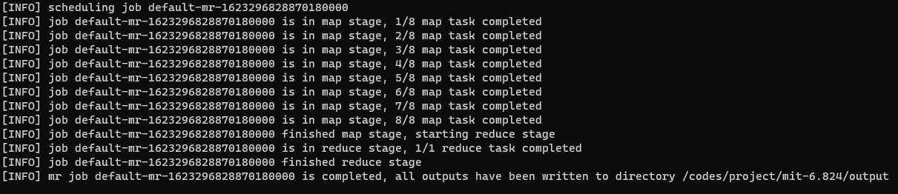

# MIT-6.824

This is my code repo for the online course [MIT-6.824](http://nil.csail.mit.edu/6.824/2020/) spring 2020.

# Lab 1 (not yet autograded)

I utilized multi-processes to implement a MapReduce cluster, which contains one master and several workers. By the way, the master has the ability to detect unhelthy workers and delete them from the available workers.

## Usage

Before executing the mapreduce app, let's say `wc.go` , compile it using the go plugin mode.

```bash
jiangsheng@memeshe:/codes/project/mit-6.824/src/main$ go build -buildmode=plugin ../mrapps/wc.go
jiangsheng@memeshe:/codes/project/mit-6.824/src/main$ make
```

Then launch the cluster by first running the mrmaster and then multiple mrworkers (or single, depends on you).

```bash
jiangsheng@memeshe:/codes/project/mit-6.824/src/main$ bin/mrmaster
jiangsheng@memeshe:/codes/project/mit-6.824/src/main$ bin/mrworker
```

After the mapreduce cluster is launched, run mrdriver to submitt the job.

```bash
jiangsheng@memeshe:/codes/project/mit-6.824/src/main$ bin/mrdriver -app wc.so -output ../../output/ -inputs "pg-*" -overwrite
```

The wordcount job will be executed by the cluster. You can check its state from the master's outputs in the screen.



Have a look to the output:

```bash
jiangsheng@memeshe:/codes/project/mit-6.824/src/main$ head ../../output/default-mr-1623295422671577600-1623295422673041900-0
A 509
ABOUT 2
ACT 8
ACTRESS 1
ACTUAL 8
ADLER 1
ADVENTURE 12
ADVENTURES 7
AFTER 2
AGREE 16
```

## How to improve?

1. fail-over. Currently if some map/reduce tasks crash on some machines, the total job cannot resume to a normal state. We should let the master know whether the tasks are executed successfully. If not, it should re-schedule the task to some other workers available.
2. map partition. In the practice of Apache Hadoop, the input will be splitted to several blocks and each block is considered as the input of the corresponding map task. But I just launch map tasks for every input file, which means that if the sizes of those input files differ a lot, the workload of map tasks is not balanced, and it can do harm to the total performance.
3. code. I did not use so much software engineering techniques. The framework can be written in a more abstract pattern.